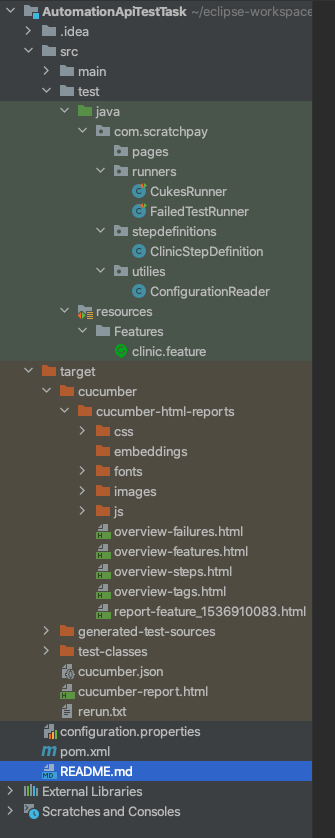

# AutomationApiTestTask

##Cucumber-Java

This repository contains a collection of sample Cucumber-Java projects and libraries that demonstrate how to use the tool and develop automation scripts using the Cucumber BDD framework with Java as a programming language.

It automatically generates Surfire, Cucumber, HTML and JSON reporters as well. It also generates screenshots for your tests if you enable it and also generates error shots for your failed test cases as well.

##Installation (pre-requisites)

JDK 1.8+ (make sure Java class path is set)
Maven (make sure .m2 class path is set)
IntelliJ/Eclipse
IntelliJ/Eclipse Plugins for
Maven
Cucumber
Git

#Framework set up

Fork / Clone repository from [here](https://github.com/eyupUK/taskScratch.git) or download zip and set it up in your local workspace.

##Framework Overview

The Cucumber BDD testing framework specifies acceptance tests as written from the view of the Product Owner.

Using keywords such as Given, When, Then and And, acceptance criteria tests known as feature files can then be broken down into testable steps. 

Cucumber framework runs by specifying the test cases using tags that are to be run.

Cucumber - Overall test framework leveraging the Cucumber framework written in JAVA.

pom.xml file - It is used to download and upload libraries and tools using dependencies and builds that you will need in the framework.

Feature File - The feature file specifies the steps in the BDD language style.

Step Definition - Java class whereby the steps from the feature file are broken down to be coded into automation tests.

Feature Model Class - Java class whereby the step definition calls on methods that require action from the automated user such as entering text, finding/asserting fields on the UI

Cucumber Reports - Cucumber has a built-in report generation whereby Feature files tested are automatically written to Cucumber’s own reporting system.

Utilities- Utilities package may consist of UI/Database/API/Excel/MS Office/Driver/ConfigReader utility classes including testing methods that are used often in Singleton Model.

Configuration Reader - CR class reads the properties file from configuration.properties.

configuration.properties - It is used to manage credentials and access points that are used in Singleton Model

#Run Some Sample Tests

Open terminal (MAC OSX) or command prompt / power shell (for windows OS) and navigate to the project directory type mvn verify or mvn test command to run features. With this command, it will execute the tests.

To run specific feature if you have multiple feature files use, mvn test -Dcucumber.options="classpath:features/my_first.feature"

To run a specific scenario, you can use tags that scenarios have, type in to console or command prompt as mvn verify -Dcucumber.filter.tags="@TC002"

##Reporters

Once you run your tests, the framework generates the various types of reports taking screenshots of failures and errors automatically. 

This framework Cucumber-Java generates several types of test reporters to communicate pass/failure.

Cucumber Report:

HTML Report:

JSON Report:

Developed automation scripts using the BDD approach

Tests are written in the Cucumber framework using the Gherkin Syntax. More about [Gherkin](https://cucumber.io/docs/gherkin/) & Cucumber can be found at [here](https://cucumber.io/docs/reference) A typical test will look similar to this:

Feature: Performing a Yahoo Search

    As a user on the Yahoo search page
    I want to search for Selenium-Webdriver
    Because I want to learn more about it

    Background:

        Given I am on the search page

    Scenario: Performing a search operation
        When I enter "Selenium Webdriver" into the search box
        And  I click the search button
        Then I should see a list of search results

    Scenario Outline: Performing a search operation with passing test data as data table
        When I enter <searchItem> into the search box
        And  I click the search button
        Then I should see a list of search results

        Examples:
        |searchItem|
        |"Selenium Webdriver"|

#Contribution

Create a fork of the project into your own repository. Make all your necessary changes and create a pull request with a description on what was added or removed and details explaining the changes in lines of code. If approved, project owners will merge it.

Licensing
MIT
